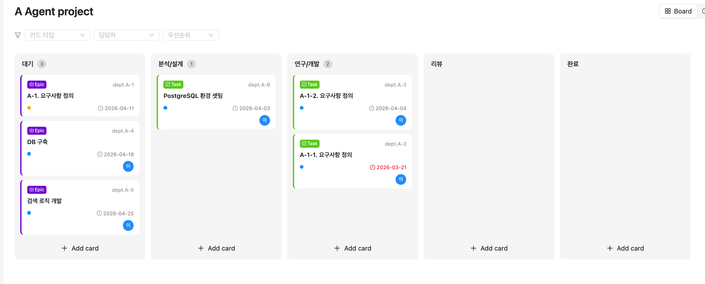
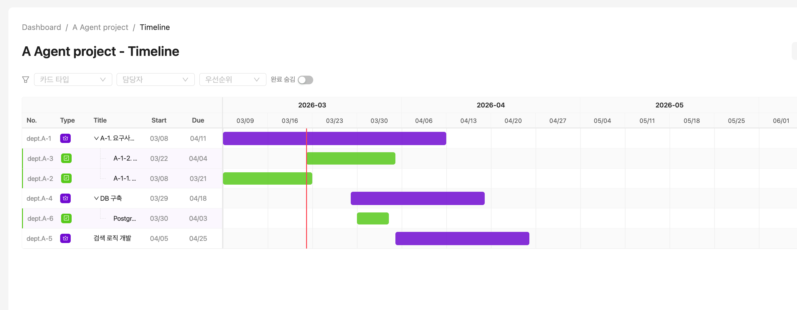

# Crewspace

외부 SaaS 형태의 프로젝트 관리 도구를 사용할 수 없는 환경을 위해 만든 셀프 호스팅 프로젝트 관리 시스템입니다. 보안 정책이나 네트워크 제약으로 Jira, Notion 같은 외부 서비스를 쓸 수 없는 팀이 자체 서버에 설치하여 사용할 수 있습니다.

칸반 보드, 타임라인(Gantt), 팀/프로젝트 관리, 대시보드 등 프로젝트 관리에 필요한 기능을 제공합니다.

## 화면

### 칸반 보드
카드를 드래그 앤 드롭으로 상태 변경하고, Epic > Story > Task > Sub-task 계층 구조로 작업을 관리합니다.



### 타임라인
Gantt 차트 형태로 일정을 시각화하고, 계층 구조를 트리 커넥터로 표현합니다.



## 주요 기능

- **칸반 보드** - 드래그 앤 드롭, 카드 계층 구조(Epic/Story/Task/Sub-task), 완료 카드 자동 숨김
- **타임라인** - Gantt 차트, 트리 커넥터, 드래그 앤 드롭 순서 변경
- **팀 관리** - 팀 생성, 멤버 초대, 역할 기반 접근 제어
- **대시보드** - 프로젝트/카드 현황, 기한 초과 경고, 마감 임박 알림
- **관리자 패널** - 시스템 전체 사용자 및 팀 관리 (Superadmin 전용)
- **필터/검색** - 카드 타입, 담당자, 우선순위 필터링, 통합 검색

## 사전 준비

### Docker로 실행하는 경우

- Docker, Docker Compose

### 직접 실행하는 경우

- Python 3.12+
- Node.js 20+
- PostgreSQL 16+

## 설치 및 실행

### 1. 저장소 클론

```bash
git clone https://github.com/your-org/crewspace.git
cd crewspace
```

### 2. 환경 변수 설정

```bash
cp .env.example .env
```

`.env` 파일을 열어 아래 항목을 수정합니다.

```env
# PostgreSQL
POSTGRES_HOST=postgres          # 직접 실행 시 localhost로 변경
POSTGRES_PORT=5432
POSTGRES_DB=crewspace
POSTGRES_USER=crewspace
POSTGRES_PASSWORD=changeme_strong_password

# Host Port Mapping (Docker 사용 시)
HOST_BACKEND_PORT=8000
HOST_FRONTEND_PORT=3000
HOST_POSTGRES_PORT=5432

# JWT
SECRET_KEY=changeme_jwt_secret_key_at_least_32_chars
ALGORITHM=HS256
ACCESS_TOKEN_EXPIRE_MINUTES=15
REFRESH_TOKEN_EXPIRE_DAYS=7

# CORS
CORS_ORIGINS=http://localhost:3000,http://localhost:5173

# Superadmin (최초 실행 시 자동 생성)
SUPERADMIN_EMAIL=admin@crewspace.local
SUPERADMIN_USERNAME=admin
SUPERADMIN_PASSWORD=changeme_admin_password
```

`POSTGRES_PASSWORD`, `SECRET_KEY`, `SUPERADMIN_PASSWORD`는 반드시 기본값에서 변경하는 것을 권장합니다.

### 3-A. Docker로 실행 (권장)
Docker로 실행하는 것을 권장합니다.

```bash
docker-compose up --build
```

최초 실행 시 DB 마이그레이션이 자동으로 적용됩니다.

```bash
# 백그라운드 실행
docker-compose up -d --build

# 로그 확인
docker-compose logs -f backend

# 중지
docker-compose down
```

### 3-B. 직접 실행

PostgreSQL이 실행 중이어야 합니다. `.env`의 `POSTGRES_HOST`를 `localhost`로 변경하세요.

**Backend:**

```bash
cd backend
pip install -r requirements.txt
alembic upgrade head                              # DB 마이그레이션
python -m uvicorn app.main:app --reload --port 8000
```

**Frontend:**

```bash
cd frontend
npm install
npm run dev       # localhost:5173에서 실행, /api 요청은 localhost:8000으로 프록시
```

### 4. 접속

| 항목 | URL |
|------|-----|
| Frontend | http://localhost:3000 (Docker) / http://localhost:5173 (직접 실행) |
| Backend API | http://localhost:8000 |
| API 문서 (Swagger) | http://localhost:8000/docs |

최초 로그인은 `.env`에 설정한 Superadmin 계정으로 합니다.


## 기술 스택

| 구분 | 기술 |
|------|------|
| Backend | Python 3.12, FastAPI, SQLAlchemy 2.0 (async), Alembic |
| Frontend | React 18, TypeScript, Ant Design 5, TanStack Query |
| Database | PostgreSQL 16 |
| Auth | JWT (Access Token 15min + Refresh Token 7days) |
| Infra | Docker, Docker Compose, Nginx |

## 라이선스

MIT License
